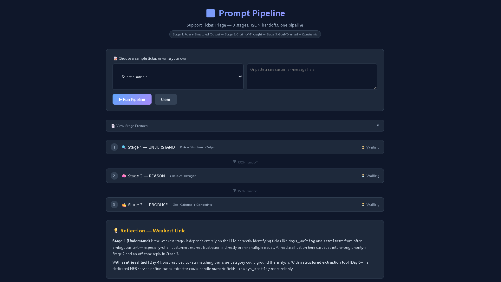
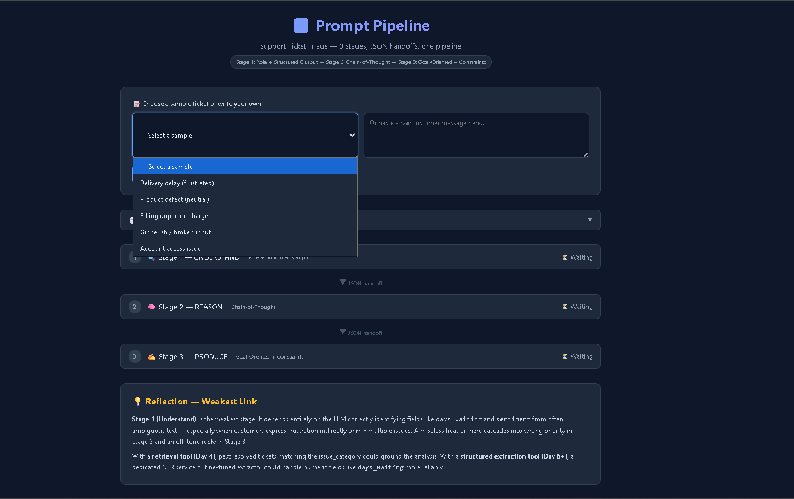
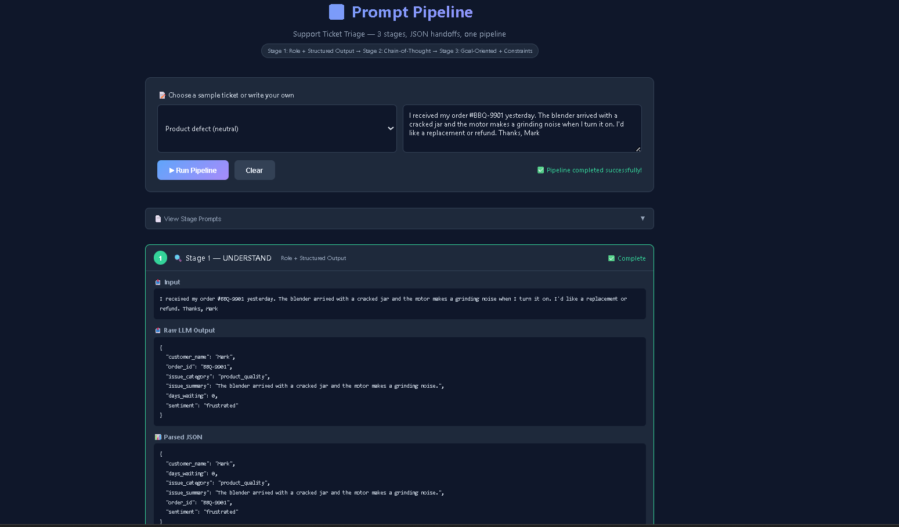
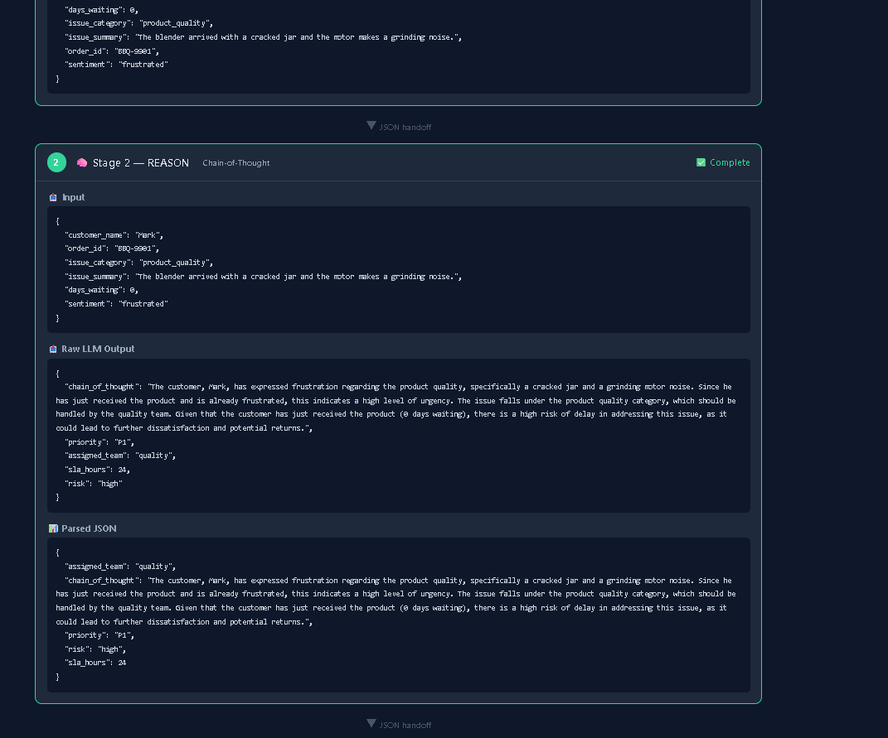
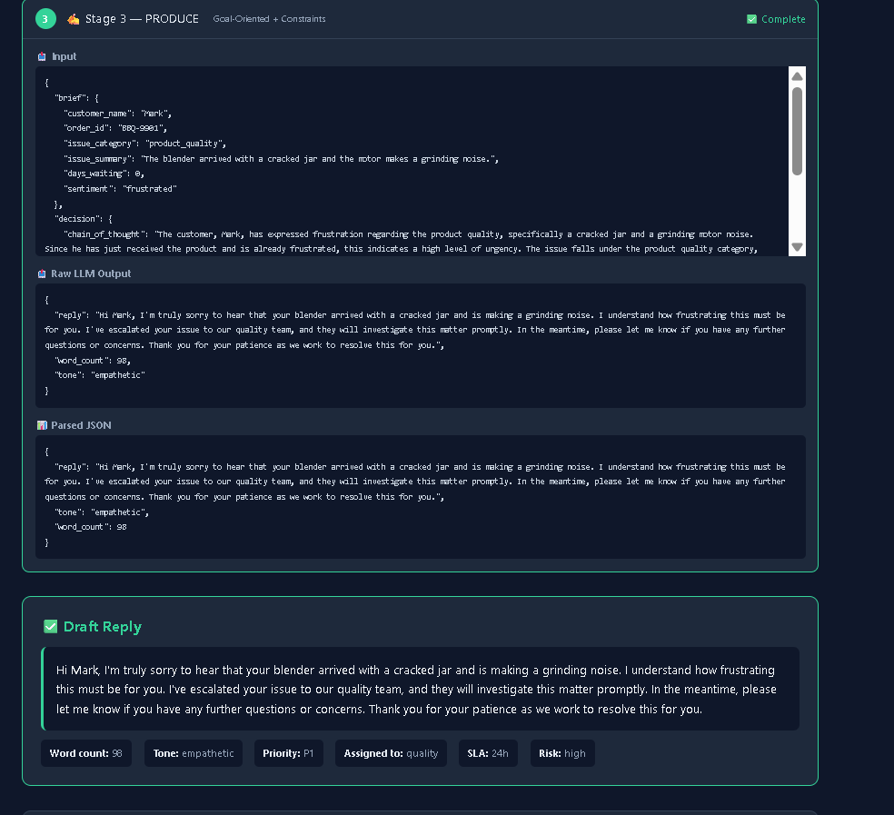

# prompt_pipeline
=======
# 🔄 Prompt Pipeline — Support Ticket Triage

A **prompt-only task-completer** that chains 3 LLM calls together with structured JSON handoffs to turn a raw customer support message into a fully triaged ticket with a drafted reply.

Built from scratch for the **GenAI & Agentic AI Engineering** Day 2 homework — no RAG, no tools, no scaffold. Just well-engineered prompts and the data flowing between them.

---

## ✨ What It Does

| Input | → Stage 1 | → Stage 2 | → Stage 3 | Output |
|-------|-----------|-----------|-----------|--------|
| Raw customer message | **UNDERSTAND** (Role + Structured Output) | **REASON** (Chain-of-Thought) | **PRODUCE** (Goal-Oriented + Constraints) | Structured ticket + drafted reply |

**Example:** A messy complaint like *"My order is late!"* goes in one end, and a polished support reply with priority, team assignment, and SLA comes out the other.

---

## 🏗️ Architecture

### Pipeline Stages

| Stage | Technique | Input | Output |
|-------|-----------|-------|--------|
| **1. UNDERSTAND** | Role + Structured Output | Raw text | `{customer_name, order_id, issue_category, issue_summary, days_waiting, sentiment}` |
| **2. REASON** | Chain-of-Thought | Stage 1 JSON | `{chain_of_thought, priority(P1/P2/P3), assigned_team, sla_hours, risk}` |
| **3. PRODUCE** | Goal-Oriented + Constraints | Stage 1 + 2 JSON | `{reply (≤120 words), word_count, tone}` |

### Key Features

- **Structured JSON handoffs** — every stage returns JSON consumed by the next; no stage reads raw prose
- **Chain-of-thought** — Stage 2 explicitly reasons step-by-step before committing to a decision
- **Parse-with-retry** — if a stage returns malformed JSON, the error is shown back to the model and re-asked (max 2 retries)
- **Graceful broken input** — gibberish, missing fields, or wrong language produce sensible defaults instead of crashes
- **3-attempt LLM caller** — with exponential backoff for API failures

---

## 📁 Project Structure

```
propmt_pipeline/
├── .env                          # OpenRouter API key
├── README.md                     # This file
├── prompt_pipeline.py            # Standalone CLI version
├── backend/
│   ├── requirements.txt          # Python dependencies
│   ├── pipeline.py               # Core engine: 3-stage prompt pipeline
│   └── app.py                    # Flask API server
└── frontend/
    └── index.html                # Modern single-page UI
```

---

## 🚀 Getting Started

### Prerequisites

- Python 3.10+
- An [OpenRouter](https://openrouter.ai/) API key (set in `.env`)

### Setup

1. **Clone the repo** and navigate to the project directory:
   ```bash
   cd propmt_pipeline
   ```

2. **Set your API key** in `.env`:
   ```
   OPENROUTER_API_KEY=sk-or-v1-your-key-here
   ```

3. **Install dependencies**:
   ```bash
   pip install flask flask-cors requests
   ```

### Run the CLI Version (standalone)

```bash
python prompt_pipeline.py
```

This runs 4 test cases (3 normal + 1 broken input) and prints every stage's JSON with the final reflection on the weakest link.

### Run the Web App (full-stack)

```bash
python backend/app.py
```

Then open **http://127.0.0.1:5000** in your browser.

---

## 🖥️ Web UI

The frontend is a single HTML file with no build step. It provides:

| Feature | Description |
|---------|-------------|
| **Sample dropdown** | 5 pre-loaded tickets (delivery, product defect, billing, broken input, account issue) |
| **Prompt viewer** | Collapsible section showing the full prompt for each stage |
| **Stage cards** | Each stage shows: input → raw LLM output → parsed JSON |
| **JSON handoff arrows** | Visual "▼ JSON handoff" connectors between stages |
| **Final reply** | Drafted reply with metadata (word count, tone, priority, team, SLA, risk) |
| **Error display** | Red error box if any stage fails |
| **Reflection** | Built-in note on the weakest link |

### API Endpoints

| Endpoint | Method | Purpose |
|----------|--------|---------|
| `/` | GET | Serves the frontend |
| `/api/samples` | GET | Returns 5 sample tickets |
| `/api/prompts` | GET | Returns the 3 stage prompts |
| `/api/run` | POST | Runs the pipeline on submitted text |

---
## 📸 Screenshots / Demo

### 🏠 Home Page


### 📂 Select Sample


### 🧪 Result 1


### 🧪 Result 2


### 🧪 Result 3


## 🧪 Test Runs

All 4 test cases complete successfully:

1. **Delivery delay** (Sarah, ORD-4421) → P1 → logistics, 24h SLA → empathetic 63-word reply
2. **Product defect** (Mark, BBQ-9901) → P1 → quality, 4h SLA → empathetic 106-word reply
3. **Billing duplicate** (Jane) → P1 → billing, 2h SLA → empathetic 63-word reply
4. **Gibberish input** (`asdlkfj 12345 !@#$%^&*()`) → gracefully handled → P3 → support, 48h SLA → neutral 49-word reply

---

## 💡 Reflection — Weakest Link

**Stage 1 (Understand)** is the weakest stage. It depends entirely on the LLM correctly identifying fields like `days_waiting` and `sentiment` from often ambiguous text — especially when customers express frustration indirectly or mix multiple issues. A misclassification here cascades into wrong priority in Stage 2 and an off-tone reply in Stage 3.

**How to fix it (Days 4 & 6 preview):**
- **Day 4 (Retrieval):** Pull past resolved tickets matching the `issue_category` to ground the analysis
- **Day 6+ (Tools):** Call a dedicated NER service or fine-tuned extractor model rather than relying on a general-purpose LLM to guess numeric fields like `days_waiting`

---

## 📚 What I Learned

- Breaking a complex task into smaller prompt stages is the core skill behind agentic AI
- Structured JSON handoffs between stages are the "interface contract" — getting this right prevents cascading failures
- A simple parse-and-retry loop around JSON output is essential when prompts feed each other
- Every pipeline needs a strategy for bad inputs (default, skip, or ask)

---

## 🎯 Stretch Goals Implemented

- ✅ Parse-with-retry (re-prompt on malformed JSON, max-attempts guard)
- ✅ Graceful broken input handling
- ✅ Full-stack web UI with inspectable stage-by-stage output
- ✅ Chain-of-thought reasoning visible in Stage 2
